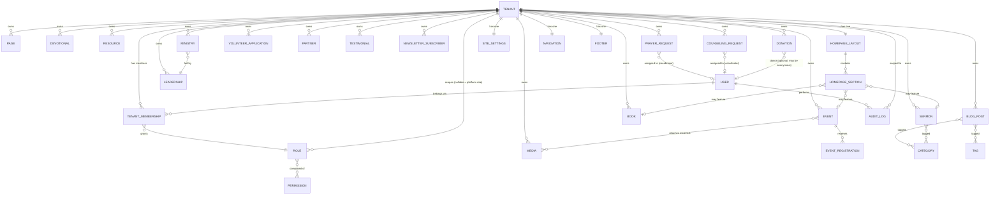

# Database Schema & Entity Relationship Diagram
## JBIM Ministry Management Platform

Status: Draft for review · Phase 3 of 5
Depends on: [02-architecture.md](02-architecture.md)

Notation note: every entity below except `Tenant`, `Permission`, and `AuditLog` carries a `tenant` foreign key even where not drawn in the simplified diagram, per the multi-tenancy strategy in the architecture doc. Payload's Postgres adapter materializes this as real relational tables (including array/relationship fields), so this is a genuine SQL schema, not a JSON-blob approximation.

---

## 1. Entity Relationship Diagram (core entities)

`TENANT_MEMBERSHIP` is the join entity behind "a user can hold different roles in different tenants" (FR-RBAC-04) — modeled in Payload as an array field on `User` (`tenantMemberships: [{ tenant, role }]`), which the Postgres adapter stores as a proper child table, not a JSON column.

---

## 2. Collection Field Reference

### Tenant
| Field | Type | Notes |
|---|---|---|
| name | text | |
| slug | text, unique | used for `*.platform.app` subdomain |
| domains | array<text> | custom domains, unique across the whole table |
| branding.logoLight / logoDark | upload → Media | |
| branding.colors | group (primary/secondary/accent hex) | |
| defaultLocale / supportedLocales | select / array | seeds Payload's `localization` config per tenant at render time |
| paypal.clientId / merchantEmail | text (clientId encrypted at rest) | FR-DON-01 |
| status | select: active / suspended | FR-TENANT-05 |

### User
| Field | Type | Notes |
|---|---|---|
| email, password | Payload built-in auth fields | bcrypt hashing, verification, reset built in |
| name, avatar | text, upload | |
| isPlatformSuperAdmin | checkbox | cross-tenant flag, see [04-auth-rbac.md](04-auth-rbac.md) |
| tenantMemberships | array<{ tenant: relationship, role: relationship }> | FR-RBAC-04 |
| twoFactorEnabled / twoFactorSecret | checkbox / text (encrypted) | NFR-04 |
| status | select: active / deactivated | FR-RBAC-05 |

### Role
| Field | Type | Notes |
|---|---|---|
| tenant | relationship → Tenant, **nullable** | null = platform-scope role |
| name | text | e.g. "Prayer Coordinator" |
| permissions | array<relationship → Permission> | FR-RBAC-01/02 |
| isSystemRole | checkbox | seeded default roles (§2.1 of SRS); protected from deletion, editable |

### Permission
Reference/seed collection, not user-editable in normal operation.
| Field | Type | Notes |
|---|---|---|
| key | text, unique | e.g. `sermons.publish`, `donations.view` |
| module | select | groups permissions in the Role-builder UI |
| description | text | |

### Page
| Field | Type | Notes |
|---|---|---|
| slug | text, localized-safe (locale-independent URL, localized content) | |
| title, blocks | localized text / blocks array | body uses the shared block library |
| seo | group (plugin-seo) | FR-CMS-03 |
| _status | draft / published (Payload versions) | |

### Ministry
name, slug, description (localized richtext), leader (relationship → Leadership), image, order, seo.

### Leadership
name, title, bio (localized), photo, isFounder (checkbox), order.

### Event
title (localized), slug, type (enum), startDate/endDate, location or livestreamUrl, capacity, registrationOpen/registrationClose, materials (relationship[] → Media), _status.

### EventRegistration
event (relationship), name, email, phone, registeredAt, checkedIn (checkbox), waitlisted (checkbox, auto-set once capacity reached per FR-EVT-06).

### Sermon
title (localized), type (audio/video/written), speaker, scripture (array<text>), topics (relationship[] → Category), mediaFile (upload) or embedUrl, date, seo.

### Devotional
title (localized), body (localized richtext), cadence (daily/weekly/series), series (relationship, self-referential grouping), date.

### Book / Resource
title, author (defaults to Founder Leadership record), coverImage/file or externalLink, description, type (Resource only: study-guide/prayer-guide/discipleship-manual/teaching-notes), gated (checkbox, Resource only).

### Media
Payload upload collection backed by R2; alt (required, NFR-06), tags (array<text>), mimeType (system).

### BlogPost
title (localized), slug, body (localized), categories/tags (relationship[]), author (relationship → User or Leadership), publishedAt, _status.

### PrayerRequest
name, contact, requestText, isPrivate (checkbox, default true), status (new/in-prayer/answered/closed), assignedTo (relationship → User, filtered to Prayer Coordinator role), internalNotes (array<{author, note, createdAt}>), createdAt.

### CounselingRequest
Same shape as PrayerRequest plus `type` (biblical/family/marriage/individual); `confidential` is not a field — visibility is enforced entirely in access control (see auth doc), not a toggle a submitter controls.

### VolunteerApplication
name, contact, areaOfInterest, message, status (new/reviewing/approved/declined), createdAt.

### Partner
orgName or individualName, contact, engagementType (prayer/financial/volunteer/project-sponsor/mission-trip), logo (optional, for public "Partner Logos" display), status, createdAt.

### Testimonial
submitterName, content (localized), photo, status (submitted/approved/published — only "published" renders publicly, FR-CMS-08).

### NewsletterSubscriber
email, confirmed (checkbox), confirmedAt, unsubscribedAt (nullable — presence = inactive).

### Donation
donorName (nullable if anonymous), donorEmail, amount, currency, usdAmount, fund (select: general/mission-projects/child-sponsorship/special-campaign), paypalTransactionId (unique), paypalSubscriptionId (nullable, recurring only), status (completed/refunded/failed), createdAt. **Never stores card/PayPal credentials** — only the transaction reference (FR-DON-05).

### AuditLog
user (relationship → User), action (create/update/delete), collectionSlug, documentId, previousValue (jsonb), newValue (jsonb), timestamp, tenant. No update/delete route exposed anywhere in the API (FR-AUDIT-03).

### Globals (one row per tenant)
- **SiteSettings** — siteName, contactEmail/Phone, socialLinks, notificationPreferences, analytics{gaId, gscId, clarityId}.
- **Navigation** — items: array<{label (localized), link, order, children}>.
- **Footer** — columns, socialLinks, copyrightText.
- **HomepageLayout** — sections: array<{ blockType, order, visible, config }> — this is FR-HOME's entire data model; the block library itself lives in code (`src/blocks/`), the *instance data* (which blocks, in what order, with what content) lives here per tenant.

---

## 3. Indexing & Integrity Notes
- Every tenant-owned table: composite index on `(tenant_id, status)` or `(tenant_id, slug)` as appropriate — access-control filters always include tenant, so it must never be a full scan.
- `Tenant.domains` and `Tenant.slug`: unique constraints at the DB level, not just app-level validation — a duplicate domain must be impossible to insert even via a race condition.
- `Donation.paypalTransactionId`: unique constraint — idempotency guard against a webhook being delivered twice (PayPal does not guarantee exactly-once delivery).
- `AuditLog`: append-only at the database level — the Payload access-control `update`/`delete` functions return `false` unconditionally, and this is additionally enforced with a Postgres `REVOKE UPDATE, DELETE` on the underlying role Payload connects as, so it's not solely an application-layer promise.

---

Next: [04-auth-rbac.md](04-auth-rbac.md) — how `hasPermission`, tenant scoping, and the role/permission model above actually get enforced on every request.
